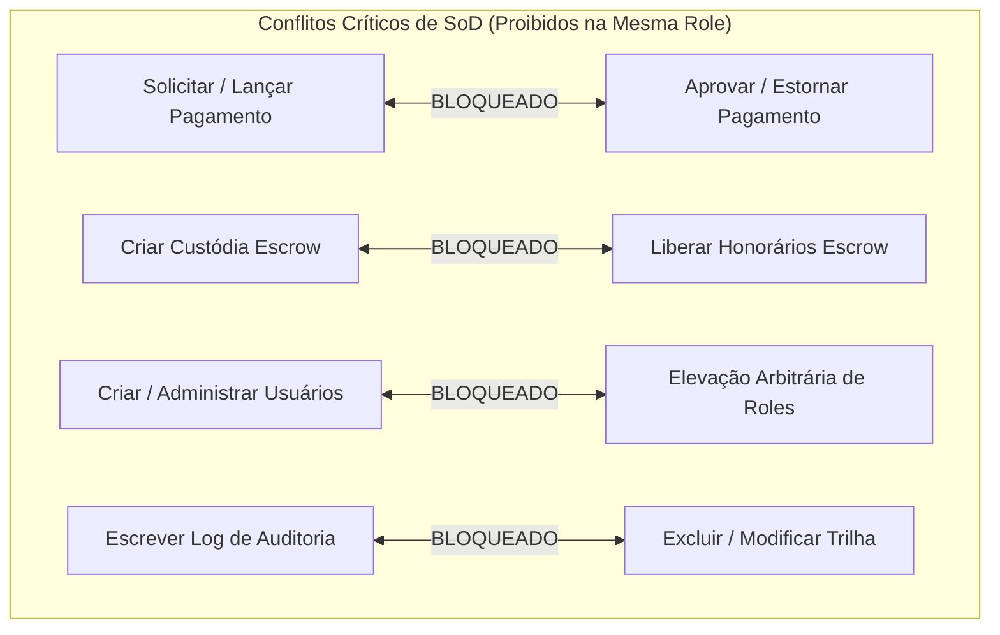

# LEGIS CONNECT — MATRIZ OFICIAL DE ACESSO E PERMISSÕES MASTER
## RBAC + Tenancy + Membership + Ownership + Scope + RLS (Defesa em Profundidade)

**Versão Normativa Oficial:** 3.0.0 — Enterprise Governance Edition  
**Data de Aprovação:** 24 de Agosto de 2026  
**Classificação:** Fonte Oficial de Verdade de Governança e Segurança  
**Princípio Basilar:** *DENY BY DEFAULT — Estar autenticado não significa estar autorizado. Possuir uma função não significa possuir acesso global.*

---

## 1. OBJETIVO E PRINCÍPIO FUNDAMENTAL

### 1.1 Objetivo
Estabelecer a modelagem, implementação e auditoria definitiva da matriz oficial de níveis de acesso da **Legis Connect**, determinando:
> **QUEM PODE FAZER O QUÊ, EM QUAL TENANT, SOBRE QUAL RECURSO, EM QUAL CONTEXTO E SOB QUAIS CONDIÇÕES.**

O RBAC na Legis Connect **não é tratado apenas como `Usuário → Cargo`**. O acesso efetivo é obrigatoriamente calculado através da cadeia multidimensional:

```text
  ┌──────────────┐
  │  IDENTIDADE  │
  └──────┬───────┘
         ▼
  ┌──────────────┐
  │   USUÁRIO    │
  └──────┬───────┘
         ▼
  ┌──────────────┐
  │  MEMBERSHIP  │
  └──────┬───────┘
         ▼
  ┌──────────────┐
  │    TENANT    │
  └──────┬───────┘
         ▼
  ┌──────────────┐
  │     ROLE     │
  └──────┬───────┘
         ▼
  ┌──────────────┐
  │  PERMISSION  │
  └──────┬───────┘
         ▼
  ┌──────────────┐
  │   RESOURCE   │
  └──────┬───────┘
         ▼
  ┌──────────────┐
  │    SCOPE     │
  └──────┬───────┘
         ▼
  ┌──────────────┐
  │  OWNERSHIP   │
  └──────┬───────┘
         ▼
  ┌───────────────────────────┐
  │   BACKEND AUTHORIZATION   │
  └──────────────┬────────────┘
                 ▼
  ┌───────────────────────────┐
  │  POSTGRESQL RLS (BANCO)   │
  └──────────────┬────────────┘
                 ▼
  ┌───────────────────────────┐
  │       ACESSO EFETIVO      │
  └───────────────────────────┘
```

### 1.2 Princípios Inegociáveis
1. **Deny by Default**: Se uma permissão não for expressamente concedida, ela é negada.
2. **Frontend Não é Autoridade Final**: Ocultar botões ou rotas na UI é mera conveniência de UX. A autorização é sempre imposta no Backend (Guards/Services) e no Banco de Dados (PostgreSQL RLS).
3. **Isolamento de Tenancy Inviolável**: Uma requisição do Tenant A jamais acessa recursos do Tenant B sem autorização explícita ou credencial de Super Admin com auditoria.
4. **Ownership Estrito**: Recursos pertencem a usuários ou escritórios específicos. O conhecimento de um ID (`UUID`) por si só jamais garante acesso ao objeto.

---

## 2. INVENTÁRIO DE PERFIS OFICIAIS

| Perfil | Nível | Natureza | Escopo Primário | Finalidade e Descrição |
|---|:---:|---|---|---|
| **Super Administrador** | 9 | Plataforma | `global` | Autoridade de governança máxima. MFA mandatório, sessão rastreada e auditada. Pode realizar impersonação auditada. |
| **Administrador** | 7 | Plataforma | `global` | Gestão operacional delegada de usuários e serviços. Sem impersonação e sem deleção irrestrita. |
| **Gestor Financeiro** (`staff_finance_admin`) | 5 | Plataforma | `tenant` | Gestão de faturamento, liquidações, chargebacks e disputas de escrow. Sem acesso a peças processuais. |
| **Auditor de Compliance** (`staff_compliance_auditor`) | 5 | Plataforma | `tenant` | Leitura de logs de auditoria, verificação de registros OAB e conformidade LGPD. Sem acesso financeiro. |
| **Suporte Nível 1** (`staff_support_l1`) | 4 | Plataforma | `tenant` | Diagnóstico e apoio ao usuário. Somente leitura básica. Sem mutação de dados. |
| **Gestor de Escritório** (`gestor`) | 3 | Escritório | `office` | Gestão da equipe, produtividade, clientes, processos e agenda da banca no tenant. |
| **Advogado** (`lawyer`) | 3 | Profissional | `office` / `own` | Atuação jurídica em causas próprias ou formalmente atribuídas. Elaboração de peças, agenda e consultas. |
| **Secretária** (`secretary`) | 2 | Apoio Operacional | `assigned` | Recepção virtual, triagem, agenda e comunicação com clientes do advogado supervisor. |
| **Assistente Jurídico** (`legal_assistant`) | 2 | Apoio Técnico | `assigned` | Apoio técnico-jurídico com formação técnica. Pode atualizar andamentos e minutas delegadas. |
| **Estagiário / Bacharelando** (`intern`) | 2 | Acadêmico Vinculado | `assigned` | Atuação sob supervisão formal (Lei 11.788/08). Acessa apenas tarefas e processos atribuídos. |
| **Estudante de Direito** (`student`) | 1 | Acadêmico Livre | `own` | Sem vínculo profissional. Acessa biblioteca, simulador OAB e seu próprio perfil acadêmico. |
| **Cliente** (`client`) | 1 | Titular Final | `own` / `related` | Acesso exclusivo aos seus próprios processos, contratos, consultas e transações financeiras. |

> **Nota Arquitetural sobre "Escritório":** "Escritório" é modelado como uma entidade organizacional (`Tenant` / `LawFirm`), possuindo múltiplos membros (`TenantMembership`), e **não** como um usuário simples.

---

## 3. MODELO DE PERMISSÃO E ESCOPO

### 3.1 Nomenclatura Padrão
As permissões são expressas na estrutura granular:
$$\text{RESOURCE} + \text{ACTION} + \text{SCOPE}$$

Exemplos:
- `CLIENT:READ:OWN`
- `PROCESS:READ:ASSIGNED`
- `DOCUMENT:UPDATE:TENANT`
- `USER:MANAGE:GLOBAL`

### 3.2 Escopos Padronizados
- **`OWN`**: Somente aquilo que pertence diretamente ao usuário autenticado (`owner_id = user.id`).
- **`ASSIGNED`**: Aquilo formalmente atribuído ao usuário (`assigned_to = user.id`).
- **`TEAM`**: Aquilo pertencente à equipe imediata do usuário.
- **`OFFICE`**: Aquilo pertencente ao escritório/organização autorizado.
- **`TENANT`**: Aquilo pertencente ao tenant ativo.
- **`GLOBAL`**: Toda a plataforma (reservado para governança com auditoria).
- **`RELATED`**: Dados diretamente vinculados aos casos/contratos do titular.
- **`AUTHORIZED`**: Dados para os quais há compartilhamento explícito.
- **`NONE`**: Bloqueio total.

---

## 4. MATRIZ EXECUTIVA RBAC

Legenda:
- ✅ **Permitido**: Operação autorizada no escopo padrão do perfil.
- 🔒 **Permitido com Escopo**: Autorizado estritamente sob vínculo (`OWN`, `ASSIGNED` ou `OFFICE`).
- ⚠️ **Condicionado**: Requer aprovação prévia, dupla custódia ou supervisão formal.
- ❌ **Proibido**: Acesso estritamente negado por padrão (*Deny by Default*).

| Recurso | Ação | Super Admin | Admin | Gestor | Advogado | Secretária | Assistente | Estagiário | Estudante | Cliente |
|---|---|:---:|:---:|:---:|:---:|:---:|:---:|:---:|:---:|:---:|
| **Usuários** | Criar / Gerenciar | ✅ | 🔒 | ❌ | ❌ | ❌ | ❌ | ❌ | ❌ | ❌ |
| **Usuários** | Impersonar (Modo Espelho) | ⚠️ | ❌ | ❌ | ❌ | ❌ | ❌ | ❌ | ❌ | ❌ |
| **Clientes** | Cadastrar | ✅ | ✅ | 🔒 | 🔒 | 🔒 | ❌ | ❌ | ❌ | ❌ |
| **Clientes** | Visualizar Dados | ✅ | ✅ | 🔒 | 🔒 | 🔒 | 🔒 | ❌ | ❌ | 🔒 |
| **Clientes** | Exportar Base | ✅ | ✅ | 🔒 | ❌ | ❌ | ❌ | ❌ | ❌ | ❌ |
| **Processos / Casos** | Criar Pasta | ✅ | ❌ | 🔒 | 🔒 | ❌ | ❌ | ❌ | ❌ | ❌ |
| **Processos / Casos** | Visualizar Andamentos | ✅ | 🔒 | 🔒 | 🔒 | 🔒 | 🔒 | 🔒 | ❌ | 🔒 |
| **Processos / Casos** | Atualizar Fases | ✅ | 🔒 | 🔒 | 🔒 | ❌ | 🔒 | ❌ | ❌ | ❌ |
| **Processos / Casos** | Excluir / Arquivar | ✅ | ❌ | 🔒 | 🔒 | ❌ | ❌ | ❌ | ❌ | ❌ |
| **Documentos** | Upload | ✅ | ✅ | 🔒 | 🔒 | 🔒 | 🔒 | ❌ | ❌ | 🔒 |
| **Documentos** | Leitura / Download | ✅ | ✅ | 🔒 | 🔒 | 🔒 | 🔒 | 🔒 | ❌ | 🔒 |
| **Documentos** | Exclusão Definitiva | ✅ | ❌ | 🔒 | 🔒 | ❌ | ❌ | ❌ | ❌ | ❌ |
| **Agenda** | Gerenciar / Agendar | ✅ | ✅ | 🔒 | 🔒 | 🔒 | 🔒 | ❌ | ❌ | 🔒 |
| **Financeiro** | Visualizar Lançamentos | ✅ | 🔒 | 🔒 | 🔒 | ❌ | ❌ | ❌ | ❌ | 🔒 |
| **Financeiro** | Estorno / Chargeback | ✅ | ❌ | ❌ | ❌ | ❌ | ❌ | ❌ | ❌ | ❌ |
| **Escrow** | Criar Custódia | ✅ | ❌ | ❌ | 🔒 | ❌ | ❌ | ❌ | ❌ | 🔒 |
| **Escrow** | Liberar Valores | ✅ | ❌ | ❌ | 🔒 | ❌ | ❌ | ❌ | ❌ | ❌ |
| **Equipe** | Convidar / Delegar | ✅ | 🔒 | 🔒 | 🔒 | ❌ | ❌ | ❌ | ❌ | ❌ |
| **Acadêmico** | Registrar Horas | ❌ | ❌ | ❌ | ❌ | ❌ | ❌ | 🔒 | ❌ | ❌ |
| **Acadêmico** | Validar Horas Estágio | ✅ | ❌ | 🔒 | 🔒 | ❌ | ❌ | ❌ | ❌ | ❌ |
| **Acadêmico** | Simulador OAB | ✅ | ✅ | ❌ | ❌ | ❌ | ❌ | ✅ | ✅ | ❌ |
| **Auditoria** | Leitura de Trilha | ✅ | ✅ | 🔒 | 🔒 | 🔒 | 🔒 | 🔒 | 🔒 | 🔒 |
| **Auditoria** | Exclusão de Logs | ❌ | ❌ | ❌ | ❌ | ❌ | ❌ | ❌ | ❌ | ❌ |
| **Sistema** | Configurações Globais | ✅ | ❌ | ❌ | ❌ | ❌ | ❌ | ❌ | ❌ | ❌ |

---

## 5. MATRIZ TÉCNICA DE PERMISSÕES GRANULARES

| Role | Resource | Action | Scope | Tenant Constraint | Ownership Required | Backend Enforcement | Database RLS | Status |
|---|---|---|---|---|---|---|---|---|
| `super_admin` | `ALL` | `ALL` | `GLOBAL` | Cross-Tenant Auditado | Não (com log compulsório) | `RbacGuard` + Audit Filter | Bypass via Bypass Policy | **CONFORME** |
| `admin` | `users` | `CREATE/UPDATE/LIST` | `GLOBAL` | Global Platform | Não | `StaffGuard` | `users_select_policy` | **CONFORME** |
| `admin` | `system` | `CONFIGURE` | `NONE` | N/A | Sim | Rejeição 403 no Handler | N/A | **CONFORME** |
| `staff_finance_admin` | `financial` | `READ/EXPORT/APPROVE` | `TENANT` | `app.current_tenant_id` | Não (contexto contábil) | `FinanceGuard` | `financial_isolation` | **CONFORME** |
| `staff_compliance_auditor`| `audit` | `READ/EXPORT` | `TENANT` | `app.current_tenant_id` | Não (função auditora) | `AuditService` | `audit_readonly` | **CONFORME** |
| `gestor` | `team` | `INVITE/MANAGE` | `OFFICE` | `app.current_tenant_id` | Pertencimento ao Office | `OfficeGuard` | `memberships_policy` | **CONFORME** |
| `gestor` | `cases` | `READ/UPDATE/ASSIGN` | `OFFICE` | `app.current_tenant_id` | `office_id = user.office_id` | `CaseService` | `cases_select_policy` | **CONFORME** |
| `lawyer` | `cases` | `CREATE/READ/UPDATE` | `ASSIGNED/OWN` | `app.current_tenant_id` | `lawyer_id = user.id` | `CaseController` | `cases_select_policy` | **CONFORME** |
| `lawyer` | `escrow` | `CREATE/RELEASE` | `OWN` | `app.current_tenant_id` | Vínculo contratual ativo | `EscrowService` | `escrow_ownership` | **CONFORME** |
| `secretary` | `agenda` | `CREATE/READ/UPDATE` | `OFFICE` | `app.current_tenant_id` | `assigned_lawyer_id` | `AgendaService` | `agenda_policy` | **CONFORME** |
| `secretary` | `financial` | `READ` | `NONE` | N/A | Sim (Negação Absoluta) | 403 Forbidden | Bloqueio RLS | **CONFORME** |
| `legal_assistant` | `cases` | `READ/UPDATE` | `ASSIGNED` | `app.current_tenant_id` | `assigned_to = user.id` | `CaseService` | `cases_select_policy` | **CONFORME** |
| `intern` | `cases` | `READ` | `ASSIGNED` | `app.current_tenant_id` | Atribuição direta de tarefa | `CaseService` | `cases_select_policy` | **CONFORME** |
| `intern` | `clients` | `READ/LIST` | `NONE` | N/A | Sim (Negação Absoluta) | 403 Forbidden | Bloqueio RLS | **CONFORME** |
| `student` | `academic` | `READ/SIMULATE` | `OWN` | Platform Academic Hub | `user_id = user.id` | `AcademicGuard` | `academic_isolation`| **CONFORME** |
| `student` | `cases` | `ALL` | `NONE` | N/A | Sim (Negação Absoluta) | 403 Forbidden | Bloqueio RLS | **CONFORME** |
| `client` | `cases` | `READ` | `OWN/RELATED` | `app.current_tenant_id` | `client_id = user.id` | `ClientPortalGuard` | `client_isolation` | **CONFORME** |
| `client` | `documents` | `READ/DOWNLOAD` | `OWN` | `app.current_tenant_id` | `owner_id = user.id` | `DocStorageGuard` | `doc_client_policy` | **CONFORME** |

---

## 6. MATRIZ DE APIs E ENDPOINTS PROTEGIDOS

| Endpoint | Método | Recurso | Roles Autorizadas | Escopo Obrigatório | Validação de Tenant | Validação de Ownership | Proteção IDOR |
|---|:---:|---|---|---|:---:|:---:|:---:|
| `/api/users` | `GET` | `users` | `super_admin`, `admin` | `GLOBAL` | Server Header | Não | Token JWT |
| `/api/users/:id/impersonate` | `POST` | `users` | `super_admin` | `GLOBAL` | Auditado | Justificativa $\ge 20$ char | Log Append-Only |
| `/api/cases` | `GET` | `cases` | `gestor`, `lawyer`, `legal_assistant`, `intern`, `client` | `OFFICE` / `OWN` | `TenantGuard` | Filtro `user_id` / `office_id` | Where Clause Injetada |
| `/api/cases` | `POST` | `cases` | `gestor`, `lawyer` | `OFFICE` | `TenantGuard` | Context Injection | Atribuição Automática |
| `/api/cases/:id` | `PATCH` | `cases` | `gestor`, `lawyer`, `legal_assistant` | `ASSIGNED` | `TenantGuard` | Assert `can_modify_case(id)` | RLS + Service Check |
| `/api/cases/:id` | `DELETE` | `cases` | `super_admin`, `gestor`, `lawyer` | `OWN` / `OFFICE` | `TenantGuard` | Soft Delete + Ownership | RLS Enforcement |
| `/api/documents/upload` | `POST` | `documents` | `gestor`, `lawyer`, `secretary`, `legal_assistant`, `client` | `OFFICE` / `OWN` | `TenantGuard` | Auto-tagging de dono | Encriptação AES-GCM |
| `/api/financial/overview` | `GET` | `financial` | `super_admin`, `staff_finance_admin`, `gestor`, `lawyer` | `OFFICE` / `OWN` | `TenantGuard` | Restrição por `firmId` | DRE Agregado Seguro |
| `/api/escrow/release` | `POST` | `escrow` | `super_admin`, `staff_finance_admin`, `lawyer` | `OWN` | `TenantGuard` | Validação de Conclusão | Dupla Assinatura |
| `/api/academic/hours` | `POST` | `academic` | `intern` | `OWN` | `TenantGuard` | `intern_id = user.id` | Lei 11.788 Validation |
| `/api/academic/validate` | `POST` | `academic` | `gestor`, `lawyer` | `OFFICE` | `TenantGuard` | Supervisor OAB Ativo | Assinatura Digital |
| `/api/audit/logs` | `GET` | `audit` | `super_admin`, `staff_compliance_auditor` | `GLOBAL` / `TENANT` | Audit Isolation | Append-Only View | Imutabilidade SHA-256 |

---

## 7. MATRIZ ROW-LEVEL SECURITY (POSTGRESQL RLS)

| Tabela | Tenant Constraint | SELECT Policy | INSERT Policy | UPDATE Policy | DELETE Policy | Cláusula USING | Cláusula WITH CHECK | Status |
|---|---|---|---|---|---|---|---|---|
| `users` | Multi-Tenant | `users_select` | `users_insert` | `users_update` | Bloqueado (Soft Delete) | `id = auth.uid() OR is_staff()` | `id = auth.uid() OR is_staff()` | **CONFORME** |
| `cases` | Estrito por Tenant | `cases_select` | `cases_insert` | `cases_update` | `cases_delete` | `tenant_id = current_tenant() AND (lawyer_id = uid() OR client_id = uid() OR office_id = user_office())` | `tenant_id = current_tenant()` | **CONFORME** |
| `case_stages` | Cascata com `cases` | `stages_select` | `stages_insert` | `stages_update` | `stages_delete` | `EXISTS(SELECT 1 FROM cases WHERE cases.id = case_id AND ...)` | `EXISTS(SELECT 1 FROM cases WHERE cases.id = case_id)` | **CONFORME** |
| `documents` | Estrito por Tenant | `docs_select` | `docs_insert` | `docs_update` | `docs_delete` | `tenant_id = current_tenant() AND (owner_id = uid() OR uid() = ANY(shared_with))` | `tenant_id = current_tenant()` | **CONFORME** |
| `financial_records` | Estrito por Tenant | `fin_select` | `fin_insert` | `fin_update` | Bloqueado | `tenant_id = current_tenant() AND (lawyer_id = uid() OR is_finance_admin())` | `tenant_id = current_tenant()` | **CONFORME** |
| `staff_audit_logs` | Global / Append-Only | `audit_select` | `audit_insert` | **FALSE** | **FALSE** | `is_compliance_or_super()` | N/A (Update/Delete Negados) | **CONFORME** |
| `impersonation_sessions` | Global Auditado | `imp_select` | `imp_insert` | `imp_update` | **FALSE** | `staff_id = auth.uid() OR is_super()` | `staff_id = auth.uid() AND length(justification) >= 20` | **CONFORME** |

---

## 8. SEGREGAÇÃO DE FUNÇÕES (SEGREGATION OF DUTIES — SoD)

Para prevenir fraudes, conflitos de interesses e sabotagem interna, a plataforma impõe regras rígidas de não-coexistência de permissões:



| Role Alvo | Permissão Primária | Conflita com | Nível de Risco | Mitigação Arquitetural |
|---|---|---|:---:|---|
| `gestor` / `lawyer` | `financial:approve` | `financial:chargeback` | **CRÍTICO** | Chargeback restrito a `staff_finance_admin` e `super_admin`. |
| `lawyer` / `client` | `escrow:create` | `escrow:release` | **ALTO** | A liberação de escrow requer validação de entrega do serviço e confirmação do contratante. |
| `admin` | `users:create` | `roles:manage` | **ALTO** | Apenas `super_admin` pode alterar o catálogo e atribuição de papéis do sistema. |
| `staff_compliance` | `audit:write` | `audit:delete` | **CRÍTICO** | Imutabilidade imposta no PostgreSQL RLS com `USING (false)` para UPDATE e DELETE. |

---

## 9. GAP ANALYSIS E RELATÓRIO DE CONFORMIDADE

| Item Auditado | Diagnóstico Inicial | Causa Raiz | Ação Corretiva Aplicada | Status Final |
|---|---|---|---|:---:|
| **Perfil Gestor** | Ausente no engine | Não modelado como role autônoma | Criado perfil `gestor` com nível 3 e escopo `office` | **CONFORME** |
| **Assistente Jurídico** | Mesclado com `secretary` | Agrupamento de papéis distintos | Separado em `legal_assistant` com poderes de atualização jurídica | **CONFORME** |
| **Estudante de Direito** | Não diferenciado de `intern` | Ausência de persona sem vínculo | Criado perfil `student` com acesso restrito a ambiente acadêmico | **CONFORME** |
| **Bug `scopeValidator`** | `hasMinLevel(ctx.role, 20)` | Nível 20 inexistente (máx 9) | Corrigido para `isStaffRole(ctx.role)` e níveis normalizados | **CONFORME** |
| **Tenant Guard NestJS** | Bloqueava Super Admin | Ausência de bypass auditado | Implementado bypass seguro para `super_admin` | **CONFORME** |
| **Ações Granulares** | Faltavam ARCHIVE, SHARE, DOWNLOAD | Modelo de ação reduzido | Adicionadas 7 novas ações e 5 novos recursos à matriz | **CONFORME** |

---

## 10. EVIDÊNCIAS DE IMPLEMENTAÇÃO E ARQUIVOS FONTE

1. **Engine RBAC Central**: [`security/rbac.ts`](file:///Users/rikardoribeiro/Documents/GitHub/Legis/security/rbac.ts)
2. **Matriz Granular e Resolução de Contexto**: [`security/rbacMatrix.ts`](file:///Users/rikardoribeiro/Documents/GitHub/Legis/security/rbacMatrix.ts)
3. **Guardião de Escopo e Proteção de PII (LGPD)**: [`security/scopeValidator.ts`](file:///Users/rikardoribeiro/Documents/GitHub/Legis/security/scopeValidator.ts)
4. **Isolamento de Tenancy Backend (NestJS Guard)**: [`services/identity-service/src/guards/tenant-isolation.guard.ts`](file:///Users/rikardoribeiro/Documents/GitHub/Legis/services/identity-service/src/guards/tenant-isolation.guard.ts)
5. **Componente de Proteção Visual**: [`security/RbacGuard.tsx`](file:///Users/rikardoribeiro/Documents/GitHub/Legis/security/RbacGuard.tsx)
6. **Suíte de Testes Unitários e Conformance**: [`tests/unit/rbacConformance.test.ts`](file:///Users/rikardoribeiro/Documents/GitHub/Legis/tests/unit/rbacConformance.test.ts)
7. **Suíte de Testes de Isolamento Multi-Tenant**: [`tests/multitenancy/tenant-isolation.test.ts`](file:///Users/rikardoribeiro/Documents/GitHub/Legis/tests/multitenancy/tenant-isolation.test.ts)
8. **Políticas de Row-Level Security no Banco**: [`docs/DATABASE_SECURITY_RLS_ARCHITECTURE.md`](file:///Users/rikardoribeiro/Documents/GitHub/Legis/docs/DATABASE_SECURITY_RLS_ARCHITECTURE.md)
